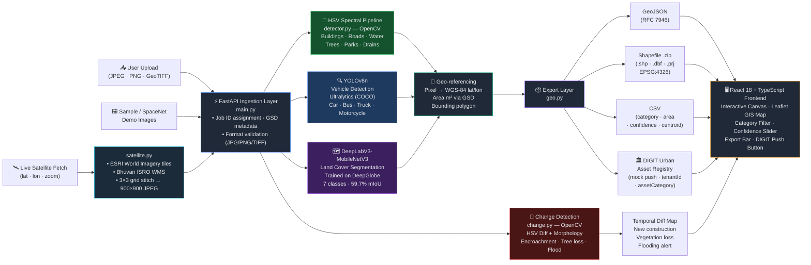

# DRISHYA — Presentation Slide Content
### AI-Powered Spatial Asset Management System | Hackzilla 2026

---

## Slide 1 — Team Name, Details & Roll Numbers

**Team Name:** *(fill in your team name)*

**Project Name:** DRISHYA
**Tagline:** *AI-Powered Spatial Asset Management for Indian Railways × eGov DIGIT*

| Name | Roll Number |
|------|------------|
| *(Member 1)* | *(Roll No.)* |
| *(Member 2)* | *(Roll No.)* |
| *(Member 3)* | *(Roll No.)* |
| *(Member 4)* | *(Roll No.)* |

**Institution:** *(Your College / University)*
**Track:** Indian Railways × eGov DIGIT — AI Powered Spatial Asset Management System

---

## Slide 2 — Problem Statement Title and Motivation

**Title:** AI-Powered Spatial Asset Management for Indian Railways

**The Problem:**
Indian Railways manages **68,000+ route kilometres** of infrastructure including railway lands, station properties, bridges, tracks, OHE, signalling installations, and drainage systems — tracked today through **paper registers, siloed spreadsheets, and costly manual surveys**.

**Real-World Consequences:**
- Illegal encroachments on railway land go **undetected for years**
- Critical drainage clogs cause **track washouts during monsoons**
- Unmapped assets cause **revenue leakage** and delay emergency relief trains
- Green cover loss (trees, parks) happens with **no early warning**
- Emergency response is hampered by **inaccurate road and water body data**

**The Opportunity:**
Satellite and drone imagery already exists — what's missing is an automated, AI-driven system to extract, classify, and register spatial assets in real time, feeding directly into the **eGov DIGIT Urban Asset Registry**.

---

## Slide 3 — Objectives of the Project

1. **Ingest** aerial, satellite, and drone imagery of urban/railway areas
2. **Detect and classify** 7 urban asset categories automatically using computer vision
3. **Provide an interactive UI** where users upload an image and instantly see detected assets overlaid with bounding boxes, labels, and confidence scores
4. **Output rich metadata** — asset type, estimated area (sq. m), geo-coordinates, and confidence scores
5. **Support live satellite fetch** from ESRI World Imagery and Bhuvan (ISRO) using real-time tile stitching
6. **Enable change detection** — compare two temporal images to flag encroachments, tree felling, and new construction
7. **Export results** in GeoJSON, CSV, and Shapefile formats for downstream GIS tools
8. **Integrate with DIGIT** — push detected asset records into a mock DIGIT Urban Asset Registry endpoint
9. **Perform pixel-level land cover segmentation** using a DeepLabV3-MobileNetV3 model trained on the DeepGlobe dataset (792 labelled WorldView satellite tiles, 7 classes)

---

## Slide 4 — Core Architecture / System Design Diagram

---

## Slide 5 — Technologies / Tools Used for Prototype Implementation

| Layer | Technology | Purpose |
|-------|-----------|---------|
| **Frontend** | React 18 + TypeScript + Vite | Interactive SPA |
| **UI Components** | Tailwind CSS + Lucide React | Styling and icons |
| **GIS Map** | Leaflet.js + React-Leaflet | Asset overlay on base map |
| **Backend** | Python 3.11 + FastAPI | REST API server |
| **Object Detection** | Ultralytics YOLOv8n | Vehicle detection (COCO) |
| **Spectral Detection** | OpenCV HSV pipeline | Buildings, roads, water, trees, drains |
| **Land Cover Segmentation** | PyTorch + DeepLabV3-MobileNetV3 | 7-class pixel segmentation |
| **Training Dataset** | DeepGlobe Land Cover (Kaggle) | 792 labelled WorldView tiles |
| **Change Detection** | OpenCV (HSV diff + morphology) | Temporal change highlighting |
| **Satellite Imagery** | ESRI World Imagery / Bhuvan ISRO | Live tile fetch |
| **Shapefile Export** | pyshp (pure Python) | GIS-compatible export |
| **GeoJSON / CSV Export** | Custom geo.py module | Downstream DIGIT integration |
| **Containerisation** | Docker (multi-stage build) | Frontend + backend in one image |
| **Deployment** | Render (free tier) | Cloud hosting |
| **Version Control** | Git + GitHub | 42 commits, full history |

---

## Slide 6 — Objectives Achieved / Results

### Must-Have Features ✅ All Completed

| Requirement | Status | Detail |
|-------------|--------|--------|
| Image Upload & Inference UI | ✅ Done | Drag-and-drop, instant overlay |
| Trained Detection Model | ✅ Done | YOLOv8n + HSV spectral pipeline |
| Detect Buildings | ✅ Done | Brightness + low-saturation mask |
| Detect Trees & Green Cover | ✅ Done | HSV vegetation mask, split by area |
| Detect Parks & Open Spaces | ✅ Done | Large vegetation contours |
| Detect Water Bodies | ✅ Done | Blue-hue HSV range |
| Detect Roads & Footpaths | ✅ Done | Low-saturation gray mask |
| Detect Drains & Sewage | ✅ Done | Dark elongated morphology |
| Asset Labels + Confidence Scores | ✅ Done | Shown on canvas and summary panel |
| Area / Count Summary | ✅ Done | sq. m per category, totals |
| Satellite Data Source Integration | ✅ Done | ESRI + Bhuvan ISRO live fetch |

### Good-to-Have Features ✅ All Completed

| Requirement | Status | Detail |
|-------------|--------|--------|
| GIS Layer Overlay | ✅ Done | Leaflet map, geo-referenced polygons |
| Change Detection | ✅ Done | Upload before/after, coloured diff overlay |
| GeoJSON Export | ✅ Done | Per-job download with geometry |
| Shapefile Export | ✅ Done | .shp/.shx/.dbf/.prj zipped (WGS-84) |
| CSV Export | ✅ Done | Category, confidence, area, centroid |

### Optional / Bonus Features ✅ All Completed

| Requirement | Status | Detail |
|-------------|--------|--------|
| DIGIT Urban Asset Registry | ✅ Done | Mock push endpoint, registryId returned |
| Vehicles & Parking (bonus category) | ✅ Done | YOLOv8 COCO classes (car, bus, truck) |
| Land Cover Segmentation | ✅ Done | DeepLabV3 trained on DeepGlobe, 7 classes |

### Key Metrics
- **7 asset categories** detected (6 required + vehicles bonus)
- **7 land cover classes** via trained segmentation model
- **792 training tiles** from DeepGlobe dataset
- **4 export formats**: GeoJSON, CSV, Shapefile, DIGIT push
- **2 satellite sources**: ESRI World Imagery, Bhuvan ISRO
- **<350 MB RAM** in production (CPU-only PyTorch, lazy model loading)

---

## Slide 7 — Merits and Demerits of the Proposed Work

### Merits

1. **Zero-shot spectral detection** — HSV pipeline detects 6 asset categories without any labelled training data, working on any satellite image out of the box
2. **Dual-model pipeline** — spectral + YOLOv8 complement each other; system degrades gracefully if YOLO is unavailable
3. **Pixel-level segmentation** — DeepLabV3-MobileNetV3 trained on DeepGlobe goes beyond bounding boxes to full land cover classification
4. **One-click DIGIT push** — assets are structured to the DIGIT schema and pushed to the Urban Asset Registry in a single request
5. **Live satellite fetch** — fetch a fresh tile of any Indian location via ESRI or Bhuvan ISRO without pre-uploading an image
6. **Lightweight deployment** — entire stack runs in a single Docker container under 350 MB RAM on a free-tier server

### Demerits

1. **Illumination-sensitive** — HSV detection degrades on overcast or shadow-heavy imagery; a fine-tuned model would be more robust
2. **False positives on bright surfaces** — bare concrete and sand can be misclassified as buildings; SpaceNet fine-tuning would improve precision
3. **CPU-only inference is slow** — segmentation takes ~2–4 s per tile; not suitable for real-time or large-area batch use
4. **No persistent time-series store** — change detection requires two manually uploaded images; automated periodic monitoring is not yet supported
5. **Mock DIGIT endpoint** — real integration would require OAuth2, tenant configuration, and schema validation against the live platform

---

## Slide 8 — Future Scope / Enhancements

1. **Fine-tuned YOLOv8 / Mask R-CNN on labelled aerial data**
   Train on SpaceNet (buildings), INRIA Aerial (buildings), and iSAID (multi-class) for high-precision bounding-box and instance segmentation without relying on colour heuristics

2. **Automated periodic monitoring pipeline**
   Schedule nightly satellite fetches for registered zones, compare with the previous snapshot, and push change-detection alerts to a DIGIT notification endpoint

3. **Real DIGIT API integration**
   Replace the mock endpoint with authenticated calls to the live DIGIT Urban Asset Registry (tenant ID, OAuth2, schema validation) for actual municipal data ingestion

4. **Building height estimation from shadows**
   Use sun-angle metadata from satellite imagery to compute shadow length and estimate building height — enabling 3D volumetric asset records

5. **Large-area tile stitching and batch processing**
   Divide a district-scale area into a grid of tiles, run detection in parallel (Celery + Redis), and merge results into a single GeoJSON/Shapefile covering hundreds of sq. km

6. **Real-time drone stream processing**
   Integrate with DJI / ArduPilot RTSP streams to run YOLOv8 inference on live video frames and display detections on a moving map

7. **Encroachment alert system**
   Compare registered asset boundaries against newly detected structures; automatically flag and timestamp any detection outside known-asset polygons as a potential encroachment

8. **Mobile field app**
   React Native companion app for on-ground inspectors to verify AI detections, capture ground truth photos, and sync corrected records back to DIGIT

---

## Slide 9 — Important Links

**(a) GitHub Repository:**
`https://github.com/tejassinghbhati/AISAMS`

**(b) YouTube Video Link:**
*(Add your demo video link here after recording)*

**Live Demo (Render):**
*(Add your Render deployment URL here)*

---

## Slide 10 — Thank You

**DRISHYA**
*AI-Powered Spatial Asset Management for Indian Railways × eGov DIGIT*

> "From satellite pixels to a live urban asset registry — automated, geo-referenced, and DIGIT-ready."

**Team:** *(Team Name)*
**GitHub:** `https://github.com/tejassinghbhati/AISAMS`
**Contact:** tejassinghbhati077@gmail.com
