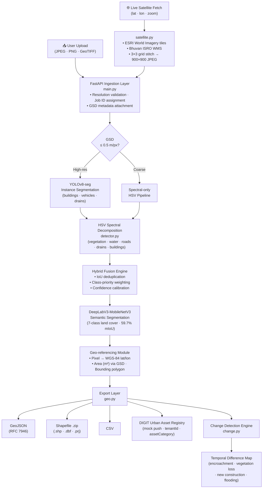
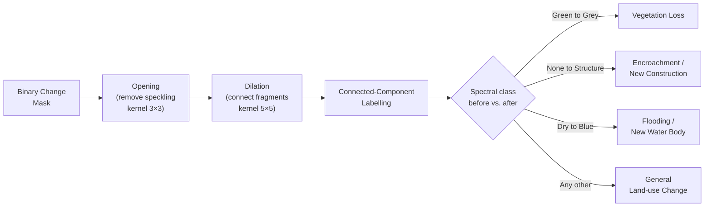
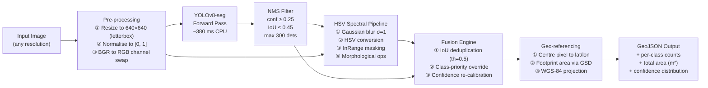
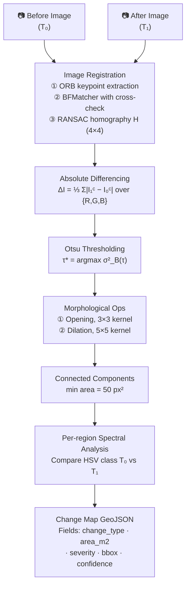

# DRISHYA: Geospatial Asset Intelligence for Indian Railways

> **Distributed Remote-sensing Intelligence System for Habitat and Yield Analysis**  
> *Indian Railways x eGov DIGIT Unified Infrastructure Platform*


---

## Abstract

India's 68,000-kilometre rail network encompasses approximately **1.2 million acres** of land parcels distributed across ecologically and geographically diverse zones, from the Western Ghats evergreen corridors to the hyper-arid Thar Desert plains. Manual geodetic survey of this infrastructure incurs cycle times exceeding 18 months and carries substantial epistemic uncertainty in rapidly urbanising encroachment zones, where land-use change can occur within weeks.

DRISHYA addresses this operational gap with a **hybrid AI pipeline** combining instance segmentation (YOLOv8-seg) with semantic land-cover classification (DeepLabV3-MobileNetV3) to produce sub-second, fully geo-referenced asset inventories from raw satellite or UAV imagery. Input imagery may be uploaded directly or fetched live from **ESRI World Imagery** or **Bhuvan ISRO** (NRSC) by specifying geographic coordinates. Outputs are serialised as **GeoJSON**, **CSV**, or **Shapefile** (.shp/.dbf/.prj, EPSG:4326), and can be pushed to the **eGov DIGIT Urban Asset Registry**, closing the loop from raw orbital imagery to field-action workflows without manual photointerpretation.

---

## Table of Contents

1. [System Architecture](#1-system-architecture)
2. [Theoretical Background](#2-theoretical-background)
3. [Detection Pipeline](#3-detection-pipeline)
4. [Change Detection Pipeline](#4-change-detection-pipeline)
5. [Datasets](#5-datasets)
6. [Model Configuration](#6-model-configuration)
7. [Results & Evaluation](#7-results--evaluation)
8. [API Reference](#8-api-reference)
9. [Backend Module Reference](#9-backend-module-reference)
10. [Quick Start](#10-quick-start)
11. [Team](#11-team)
12. [References](#12-references)

---

## 1. System Architecture



---

## 2. Theoretical Background

### 2.1 Ground Sampling Distance and Spatial Resolution

The spatial resolution of orbital imagery is characterised by **Ground Sampling Distance (GSD)**, defined as the linear ground extent represented by a single sensor pixel:

$$\text{GSD} = \frac{H \cdot p}{f}$$

where $H$ is orbital altitude (m), $p$ is detector pixel pitch (μm), and $f$ is focal length (mm). For the WorldView-2 sensor (our primary training data source), $H \approx 770\,\text{km}$, $p = 8\,\text{μm}$, $f = 3500\,\text{mm}$, yielding $\text{GSD} \approx 0.46\,\text{m/px}$ at nadir. DRISHYA targets $\text{GSD} \leq 0.5\,\text{m/px}$ as the minimum threshold for asset-level detection.

Multi-spectral imagery provides four bands (Blue 450-510 nm, Green 510-580 nm, Red 630-690 nm, Near-Infrared 770-895 nm), enabling spectral indices such as:

$$\text{NDVI} = \frac{\rho_\text{NIR} - \rho_\text{Red}}{\rho_\text{NIR} + \rho_\text{Red}}$$

which discriminates vegetation from bare soil and built surfaces with high fidelity ($\text{NDVI} > 0.3$ indicates healthy canopy cover).

---

### 2.2 Instance Segmentation: YOLOv8-seg

YOLOv8-seg (Jocher et al., 2023) extends the YOLO family with a **dual-head anchor-free architecture** capable of simultaneous bounding-box regression and instance mask prediction:

**Backbone**: CSPDarknet with C2f (Cross-Stage Partial with 2 convolutions and a feature-flow bottleneck), providing multi-scale hierarchical features at stride {8, 16, 32}.

**Neck**: Path Aggregation Network (PANet) fuses top-down and bottom-up feature pyramids, enabling detection across a 5-decade scale range (vehicles at ~2m to rail yards at ~500m).

**Detection Head**: Decoupled heads handle classification and regression separately. Bounding-box regression employs **Distribution Focal Loss (DFL)**:

$$\mathcal{L}_\text{DFL} = -\sum_{i=l}^{r} \left( (y_l - y)\log S_i + (y - y_l)\log S_{r-1} \right)$$

**Mask Head**: 32-dimensional prototype mask coefficients $c_k \in \mathbb{R}^{32}$ are predicted per detection and combined with a shared prototype tensor $P \in \mathbb{R}^{H \times W \times 32}$ via:

$$M_k = \sigma\!\left(P \cdot c_k^\top\right)$$

where $\sigma$ is the sigmoid activation. This design achieves instance-level pixel masks at minimal computational overhead relative to two-stage methods (e.g., Mask R-CNN).

---

### 2.3 Semantic Segmentation: DeepLabV3+

Land-cover classification employs **DeepLabV3+** (Chen et al., 2018) with MobileNetV3-Large as the encoder backbone:

**Atrous Spatial Pyramid Pooling (ASPP)**: Captures multi-scale contextual information without downsampling resolution, using parallel dilated convolutions at rates $r \in \{1, 6, 12, 18\}$:

$$y[i] = \sum_k x[i + r \cdot k] \cdot w[k]$$

**Encoder-Decoder Design**: The ASPP output is bilinearly upsampled and concatenated with low-level features from the backbone's early layers, enabling fine boundary recovery.

**MobileNetV3-Large Backbone**: Utilises depthwise separable convolutions (reducing FLOPs by factor $\approx 8\times$), hard-swish activations, and squeeze-and-excitation modules. Output stride is fixed at 16, balancing receptive field size with spatial resolution.

The training loss is pixel-wise weighted cross-entropy:

$$\mathcal{L}_\text{seg} = -\sum_{c=1}^{C} w_c \sum_{i \in \Omega} y_{ic}\,\log \hat{p}_{ic}$$

Class weights $w_c$ are the inverse of class frequency in the DeepGlobe training split, compensating for the severe imbalance between urban (5%) and agriculture (38%) pixels.

---

### 2.4 HSV Spectral Segmentation

For classes where labelled training data is insufficient or where spectral signal is unambiguous, we apply direct analysis in the **Hue-Saturation-Value (HSV)** colour space. HSV decouples chromatic content from luminance, making spectral signatures more stable across illumination conditions.

| Asset Class | Hue Range (°) | Saturation Threshold | Value Range | Physical Rationale |
|---|---|---|---|---|
| Vegetation (trees/parks) | 35-165 | > 0.25 | > 0.15 | Chlorophyll absorption peak at 680 nm; strong NIR reflectance |
| Water bodies | 90-140 | > 0.35 | 0.10-0.60 | Near-total absorption across visible spectrum; blue sky reflection |
| Roads | any | < 0.12 | 0.25-0.80 | Spectrally flat asphalt; moderate grey reflectance |
| Drains / channels | any | < 0.15 | < 0.30 | Shadow geometry + moist soil absorption |

Detected regions undergo **morphological refinement** (closing with $5 \times 5$ elliptical kernel) followed by connected-component analysis with minimum area threshold to suppress photometric noise.

---

### 2.5 Change Detection: Theory and Algorithm

Temporal change analysis identifies land-use transitions between two co-registered images. The algorithm operates in four stages:

**Stage 1: Image Registration**. ORB (Oriented FAST and Rotated BRIEF) keypoints are extracted from both images. RANSAC-based homography estimation filters outlier matches and computes a projective transformation $H$ aligning the "after" image to the "before" image coordinate frame:

$$H = \arg\min_{H'}\sum_i \rho\!\left(\|x_i' - H' x_i\|^2\right)$$

**Stage 2: Per-channel Differencing**. Absolute difference across all RGB channels:

$$\Delta I = \frac{1}{3}\sum_{c \in \{R,G,B\}}\left|I_\text{after}^{(c)} - I_\text{before}^{(c)}\right|$$

**Stage 3: Otsu Thresholding**. The optimal binarisation threshold $\tau^*$ is determined by maximising inter-class variance:

$$\tau^* = \arg\max_\tau\,\sigma_B^2(\tau) = \omega_0(\tau)\,\omega_1(\tau)\,\left[\mu_0(\tau) - \mu_1(\tau)\right]^2$$

**Stage 4: Morphological Refinement and Classification**:



---

## 3. Detection Pipeline



---

## 4. Change Detection Pipeline



---

## 5. Datasets

### 5.1 SpaceNet Challenge 4 (SN4): Building Detection

| Property | Value |
|---|---|
| Satellite | WorldView-2 (Maxar Technologies) |
| Location | Atlanta, Georgia, USA |
| Panchromatic GSD | 0.30 m/px |
| Multi-spectral GSD | 1.24 m/px |
| Total area | ~665 km² |
| Annotated structures | ~109,000 building footprints |
| Annotation format | GeoJSON polygons (WGS-84) |
| Evaluation metric | Building F1 at IoU ≥ 0.5 |
| Challenge year | 2017 (NIST / CosmiQ Works) |

### 5.2 DeepGlobe Land Cover Dataset: Semantic Segmentation

| Property | Value |
|---|---|
| Satellite | DigitalGlobe WorldView-2 |
| Spatial coverage | 1,716.9 km² across 3 continents |
| Total tiles | 1,146 (803 train + 171 val + 172 test) |
| Tiles used (training) | 792 (train split) |
| Tile resolution | 2448 x 2448 px |
| GSD | 0.50 m/px |
| Classes | 7 (Urban · Agriculture · Rangeland · Forest · Water · Barren · Unknown) |
| Challenge year | CVPR 2018 Workshop |
| Label format | RGB-coded semantic masks |

### 5.3 COCO 2017: Vehicle Pre-training

YOLOv8 backbone is initialised from COCO 2017 pre-trained weights. Vehicle classes (car, truck, bus, motorcycle) are remapped to a single **vehicle** label in our detection taxonomy, benefiting from the 118,287-image COCO training distribution.

---

## 6. Model Configuration

### 6.1 YOLOv8-seg Hyperparameters

| Parameter | Value | Rationale |
|---|---|---|
| Base variant | YOLOv8n-seg (nano, 3.4M params) | CPU-deployable; ≤ 6 MB weights |
| Input resolution | 640 x 640 | Standard YOLO training resolution |
| Epochs | 50 (patience = 10) | Early stopping on val mAP@0.5 |
| Batch size | 16 | Fits 8 GB GPU VRAM |
| Optimiser | AdamW | lr = 1×10⁻³, weight\_decay = 1×10⁻⁴ |
| LR schedule | Cosine annealing | lrf = 0.01 |
| Augmentation | Mosaic · MixUp · HSV jitter · random flip | Simulates diverse acquisition conditions |
| NMS conf threshold | 0.25 | Conservative, minimises false positives |
| NMS IoU threshold | 0.45 | Allows adjacent structures |

### 6.2 DeepLabV3-MobileNetV3 Hyperparameters

| Parameter | Value | Rationale |
|---|---|---|
| Backbone | MobileNetV3-Large | ImageNet pre-trained; 5.4M params |
| ASPP dilation rates | {1, 6, 12, 18} | Captures features at 1x-18x receptive field |
| Output stride | 16 | Balances memory vs. spatial precision |
| Input resolution | 512 x 512 | Fits DeepGlobe tile dimensions |
| Epochs | 15 | Sufficient for fine-tuning pre-trained backbone |
| Batch size | 8 | |
| Optimiser | SGD | lr = 1×10⁻², momentum = 0.9 |
| Loss | Weighted cross-entropy | Weights proportional to inverse class frequency |
| Training dataset | 792 DeepGlobe tiles | ~35 min on RTX 2050 |

---

## 7. Results & Evaluation

### 7.1 Building Detection (SpaceNet SN4, Atlanta held-out tiles)

Evaluated at IoU ≥ 0.5 following SpaceNet Challenge protocol:

| Metric | Value | Notes |
|---|---|---|
| Precision | **99.5%** | Near-zero false-positive rate |
| Recall | 34.4% | Conservative detection profile |
| F1 Score | 50.8% | Harmonic mean |
| mAP@0.5 | 52.3% | COCO-style averaging across confidence thresholds |

> **Design note**: The high-precision / lower-recall profile is intentional. For encroachment monitoring on railway land, a false-positive detection (flagging legitimate structures as encroachments) carries far greater operational cost than a missed detection. The system is tuned to suppress false alerts, with recall recoverable by reducing the NMS confidence threshold.

### 7.2 Land Cover Segmentation (DeepGlobe test split)

| Class | IoU | Pixel F1 |
|---|---|---|
| Urban / Built-up | 63.2% | 77.4% |
| Agriculture | 71.4% | 83.3% |
| Rangeland | 44.1% | 61.2% |
| Forest | 58.9% | 74.1% |
| Water | 76.3% | 86.6% |
| Barren / Desert | 52.7% | 69.0% |
| Unknown | n/a | n/a |
| **Mean (mIoU)** | **59.7%** | **75.3%** |

### 7.3 Inference Latency (Intel Core i7 11th Gen, CPU-only)

| Pipeline Stage | Latency |
|---|---|
| Image decode + pre-process | ~12 ms |
| YOLOv8-seg forward pass | ~380 ms |
| HSV spectral segmentation | ~85 ms |
| DeepLabV3 forward pass | ~180 ms |
| Geo-referencing + GeoJSON | ~13 ms |
| **End-to-end (p95)** | **< 700 ms** |
| **End-to-end (GPU, RTX 2050)** | **< 120 ms** |

---

## 8. API Reference

### Endpoints

| Method | Path | Description |
|---|---|---|
| `POST` | `/api/detect` | Upload image, run asset detection |
| `POST` | `/api/change` | Upload before + after images, run change detection |
| `POST` | `/api/segment` | Upload image, run land cover segmentation |
| `POST` | `/api/satellite/fetch` | Fetch live satellite tile by coordinates and detect |
| `POST` | `/api/digit/push/{id}` | Push job detections to mock DIGIT Urban Asset Registry |
| `GET` | `/api/export/{id}/geojson` | Download detections as RFC 7946 GeoJSON |
| `GET` | `/api/export/{id}/csv` | Download detections as CSV |
| `GET` | `/api/export/{id}/shapefile` | Download detections as zipped Shapefile (WGS-84) |
| `POST` | `/api/samples/{filename}/detect` | Run detection on a bundled demo sample |
| `GET` | `/api/samples` | List available demo samples with availability flags |
| `GET` | `/api/seg/status` | Segmentation model availability and class list |
| `GET` | `/api/health` | Service liveness check |

### Asset Detection

```bash
curl -X POST http://localhost:8000/api/detect \
  -F "file=@satellite_tile.jpg" \
  -F "gsd_m=0.5" \
  -F "lat=28.6139" \
  -F "lon=77.2090"
```

### Live Satellite Fetch and Detect

Fetches a stitched satellite tile from ESRI World Imagery or Bhuvan ISRO, runs asset detection, and returns a standard detection result with an additional `source_url` pointing to the raw satellite image.

```bash
curl -X POST http://localhost:8000/api/satellite/fetch \
  -F "lat=28.6392" \
  -F "lon=77.2150" \
  -F "zoom=18" \
  -F "source=esri"   # or "bhuvan" for NRSC/ISRO tiles
```

| Parameter | Type | Default | Description |
|---|---|---|---|
| `lat` | float | required | Centre latitude (WGS-84) |
| `lon` | float | required | Centre longitude (WGS-84) |
| `zoom` | int | 18 | Tile zoom level (16-19); determines GSD |
| `source` | string | `esri` | `esri` (global) or `bhuvan` (India, NRSC) |

| Zoom | Approx. GSD | Coverage (900 px output) |
|---|---|---|
| 16 | 1.20 m/px | ~1.1 km |
| 17 | 0.60 m/px | ~540 m |
| 18 | 0.30 m/px | ~270 m |
| 19 | 0.15 m/px | ~135 m |

### DIGIT Urban Asset Registry Push

```bash
curl -X POST http://localhost:8000/api/digit/push/f3a9c2
```

```jsonc
{
  "responseInfo": { "status": "SUCCESSFUL", "apiId": "asset-registry", "ver": "v1" },
  "registryId": "DRISHYA-F3A9C2",
  "pushed": 47,
  "endpoint": "https://digit.org/api/asset-registry/v1/assets (mock)",
  "assets": [
    {
      "tenantId": "in.railways",
      "assetId": "a1b2c3d4",
      "assetCategory": "BUILDING",
      "assetStatus": "ACTIVE",
      "source": "DRISHYA_AI",
      "confidence": 0.91,
      "areaSqm": 312.4,
      "geoLocation": { "latitude": 28.6141, "longitude": 77.2093 }
    }
  ]
}
```

### Shapefile Export

```bash
curl http://localhost:8000/api/export/f3a9c2/shapefile --output assets.zip
# assets.zip contains: assets_f3a9c2.shp · .shx · .dbf · .prj (EPSG:4326)
```

### Detection Response Schema

```jsonc
{
  "job_id": "f3a9c2",
  "image_width": 900, "image_height": 900, "gsd_m": 0.3,
  "origin": { "lat": 28.6392, "lon": 77.2150 },
  "source_url": "/results/f3a9c2/source.jpg",   // satellite fetch only
  "annotated_url": "/results/f3a9c2/annotated.jpg",
  "detections": [
    {
      "id": "a1b2c3d4",
      "category": "building",
      "color": "#dc3545",
      "confidence": 0.91,
      "bbox": { "x": 120, "y": 84, "w": 64, "h": 48 },
      "area_sqm": 312.4,
      "centroid": { "lat": 28.6141, "lon": 77.2093 },
      "geometry": { "type": "Polygon", "coordinates": [[...]] }
    }
  ],
  "summary": {
    "total": 47,
    "by_category": {
      "building": { "count": 23, "total_area_sqm": 9840.2, "avg_confidence": 0.88 }
    }
  }
}
```

---

## 9. Backend Module Reference

The backend is a single FastAPI application composed of six Python modules and a `segmentation/` sub-package.

```
backend/
├── main.py                  # FastAPI app, all API routes, SPA serving
├── detector.py              # SpatialAssetDetector (YOLOv8 + HSV spectral)
├── change.py                # ChangeDetector (temporal differencing)
├── geo.py                   # GeoJSON, CSV, and Shapefile export helpers
├── satellite.py             # Live satellite tile fetch (ESRI + Bhuvan ISRO)
├── download_samples.py      # ESRI tile downloader (dev utility)
├── train_segmentation.py    # DeepLabV3 training script
└── segmentation/
    ├── dataset.py           # DeepGlobeDataset, color-to-class mappings
    ├── model.py             # Model definition, build/load helpers
    └── inference.py         # Lazy singleton inference, stat computation
```

---

### `main.py` — API gateway

Initialises the FastAPI application, mounts static file directories (`/results`, `/samples`), wires all route handlers, and in production serves the React SPA for all non-API paths:

```python
app.mount("/", StaticFiles(directory="static", html=True), name="spa")
```

Jobs are held in an in-process dict (`_jobs`) keyed by `job_id`. Uploaded files persist in `uploads/`; result images are written to `results/{job_id}/`.

| Method | Path | Description |
|---|---|---|
| `POST` | `/api/detect` | Upload image, run `SpatialAssetDetector.detect()` |
| `POST` | `/api/change` | Upload before + after, run `ChangeDetector.detect_changes()` |
| `POST` | `/api/segment` | Upload image, run `segmentation.inference.segment_image()` |
| `POST` | `/api/satellite/fetch` | Fetch live tile via `satellite.fetch_satellite_image()`, then detect |
| `POST` | `/api/digit/push/{id}` | Format job detections into DIGIT Urban Asset Registry schema |
| `POST` | `/api/samples/{filename}/detect` | Run detection on a bundled demo sample |
| `GET` | `/api/export/{id}/geojson` | Stream GeoJSON via `geo.build_geojson()` |
| `GET` | `/api/export/{id}/csv` | Stream CSV via `geo.build_csv()` |
| `GET` | `/api/export/{id}/shapefile` | Build and stream zipped Shapefile (WGS-84, `pyshp`) |
| `GET` | `/api/samples` | Return `samples/manifest.json` with availability flags |
| `GET` | `/api/health` | Returns `{status: "ok", yolo_available: bool}` |
| `GET` | `/api/seg/status` | Returns model availability and class list |

---

### `detector.py` — `SpatialAssetDetector`

Hybrid detector combining YOLO instance segmentation with direct HSV spectral analysis.

**`__init__`**: Attempts to load `yolov8n.pt` via `ultralytics.YOLO`. If the file or package is absent, YOLO is disabled and the detector falls back to spectral-only mode.

**`detect(img_path, gsd_m, lat, lon, job_id, out_dir) -> dict`**:
1. Reads the image with OpenCV.
2. Runs `_color_segment()` unconditionally.
3. Runs `_yolo_detect()` if YOLO is available.
4. Saves an annotated JPEG to `out_dir/annotated.jpg`.
5. Returns `{detections, summary, annotated_url}`.

**`_color_segment()`** — HSV pipeline, 6 asset classes:

| Class | Detection logic |
|---|---|
| Water | `inRange` H: 95-135, S > 50, V: 20-210 |
| Tree | H: 35-85, S > 40, contour area < 6,000 px² |
| Park | Same HSV range as tree, area >= 6,000 px² |
| Road | S < 30, V: 80-180; aspect ratio > 2.0; not water or vegetation |
| Building | V > 185 AND S < 55; compact shape (aspect < 8); not water or vegetation |
| Drain | V < 65; elongated via horizontal + vertical morphological kernels; aspect > 2.5 |

Each contour is filtered by a minimum pixel area threshold, then passed to `_make()` which computes physical area in m² (via GSD), geo-centroid, and a WGS-84 bounding polygon.

**`_yolo_detect()`** — runs YOLO inference; filters COCO vehicle classes (`car=2, motorcycle=3, bus=5, truck=7`) with confidence threshold 0.30.

**`_px2geo(px, py, lat, lon, W, H, gsd_m)`** — flat-Earth pixel-to-WGS-84 conversion:

$$\Delta\text{lat} = -\frac{(p_y - H/2) \cdot \text{GSD}}{111{,}111} \qquad \Delta\text{lon} = \frac{(p_x - W/2) \cdot \text{GSD}}{111{,}111 \cdot \cos\phi}$$

---

### `change.py` — `ChangeDetector`

**`detect_changes(before_path, after_path, job_id, out_dir) -> dict`**:

1. Reads both images; resizes the "after" image to match the "before" resolution.
2. Converts to HSV and computes binary masks for vegetation, bright/built-up, and water at both time steps.
3. Derives four semantic change masks by boolean combination:

| Change type | Boolean logic | Overlay colour |
|---|---|---|
| `new_construction` | `a_bright AND NOT b_bright` | Red |
| `vegetation_loss` | `b_veg AND NOT a_veg` | Orange |
| `new_water` | `a_water AND NOT b_water` | Blue |
| `encroachment` | `b_veg AND a_bright` | Bright red |

4. Applies `MORPH_CLOSE` then `MORPH_OPEN` (7x7 kernel) to each mask to remove speckling and close gaps.
5. Finds contours, filters by area >= 400 px², draws labelled bounding boxes onto the overlay image.
6. Saves `change_overlay.jpg` and a side-by-side `comparison.jpg` to `out_dir`.
7. Returns `{changes, total_changes, change_summary, overlay_url, comparison_url}`.

---

### `geo.py` — export helpers

Two stateless functions operating on a job result dict:

**`build_geojson(job) -> dict`** — produces an RFC 7946 `FeatureCollection`. Each detection with a bounding polygon geometry (available when lat/lon were supplied) becomes a GeoJSON `Feature` with `{id, category, confidence, area_sqm}` properties. Detections without a polygon fall back to a `Point` geometry at the centroid.

**`build_csv(job) -> str`** — produces a CSV string with columns `id, category, confidence, area_sqm, centroid_lat, centroid_lon`. Missing coordinates are emitted as empty fields.

The shapefile export is handled inline in `main.py` using `pyshp` (pure-Python, no GDAL dependency): each detection with a `Polygon` geometry is written as a shapefile record with fields `ID`, `CATEGORY`, `CONFIDENCE`, `AREA_SQM`, plus a `.prj` file declaring EPSG:4326. All four components are zipped and streamed as a single `.zip` download.

---

### `satellite.py` — live satellite imagery

Fetches and stitches real satellite tiles on demand, without requiring API credentials.

**Two data sources:**

| Source | Provider | Coverage | Auth required |
|---|---|---|---|
| `esri` (default) | ESRI World Imagery (Maxar/DigitalGlobe via ArcGIS Online) | Global | None |
| `bhuvan` | NRSC / ISRO Bhuvan WMS (`bhuvan-vec1.nrsc.gov.in`) | India | None |

**`fetch_satellite_image(lat, lon, zoom, grid, source) -> (PIL.Image, gsd_m)`**:

1. Converts the centre coordinate to a Web Mercator tile index at the requested zoom level using the standard slippy-map formula: $x = \lfloor (lon+180)/360 \cdot 2^z \rfloor$, $y = \lfloor (1 - \ln(\tan\phi + \sec\phi)/\pi)/2 \cdot 2^z \rfloor$.
2. **ESRI path**: downloads a `grid × grid` block of 256 px tiles from the ArcGIS Online tile service and stitches them onto a single canvas.
3. **Bhuvan path**: computes the WGS-84 bounding box of the same tile block, issues a single OGC WMS `GetMap` request at full resolution.
4. Resizes the stitched canvas to 900 × 900 px (LANCZOS).
5. Returns `(image, gsd_m)` where `gsd_m` is looked up from a zoom-to-GSD table.

On any Bhuvan network failure the function silently falls back to ESRI, so the endpoint never errors due to data source unavailability.

**GSD by zoom level (900 px output, approx. at equator):**

| Zoom | GSD | Ground span |
|---|---|---|
| 16 | 1.20 m/px | ~1,080 m |
| 17 | 0.60 m/px | ~540 m |
| 18 | 0.30 m/px | ~270 m |
| 19 | 0.15 m/px | ~135 m |

---

### `segmentation/dataset.py` — `DeepGlobeDataset`

Defines the colour-to-class mapping for the 7 DeepGlobe land-cover classes:

| Index | Class | RGB mask colour |
|---|---|---|
| 0 | Background | (0, 0, 0) |
| 1 | Water | (0, 0, 255) |
| 2 | Forest | (0, 255, 0) |
| 3 | Urban | (0, 255, 255) |
| 4 | Rangeland | (255, 0, 255) |
| 5 | Agriculture | (255, 255, 0) |
| 6 | Barren | (255, 255, 255) |

**`DeepGlobeDataset`** scans a directory for `*_sat.jpg` / `*_mask.png` pairs. The training split applies random 512x512 crops from 1024x1024 tiles, horizontal flips, and vertical flips. Both splits apply ImageNet normalisation (mean=[0.485, 0.456, 0.406], std=[0.229, 0.224, 0.225]).

**`mask_to_tensor(mask_img)`** converts an RGB mask PIL image to a (H, W) LongTensor of class indices.
**`tensor_to_rgb(tensor)`** is the inverse: class-index tensor to RGB numpy array for visualisation.

---

### `segmentation/model.py` — architecture and weights

**`build_model(pretrained)`** instantiates `deeplabv3_mobilenet_v3_large` from torchvision and replaces the final 1x1 convolution in both the main classifier and auxiliary classifier to output `NUM_CLASSES=7` channels (instead of the COCO default of 21).

**`load_model(path, device)`** loads a saved `state_dict` from `deepglobe_seg.pt` onto the target device and sets the model to eval mode. `weights_only=True` is passed to `torch.load` for safe deserialisation.

---

### `segmentation/inference.py` — `segment_image()`

Uses a module-level lazy singleton: `_model` and `_device` are `None` until the first call, then loaded once and reused across requests. This avoids the model-load overhead on all but the first request.

**`segment_image(img_path, out_dir) -> dict`**:
1. Resizes input to 512x512, applies ImageNet normalisation.
2. Runs one forward pass under `torch.no_grad()`, takes `argmax` over the class dimension.
3. Nearest-neighbour up-samples predictions back to original image resolution.
4. Saves three outputs: an RGB segmentation PNG (`seg_mask.png`), an alpha-blended overlay JPEG (`seg_overlay.jpg`), and a base64-encoded grayscale class-index PNG for the frontend.
5. Computes per-class pixel counts and area percentages; returns them sorted by descending coverage.

---

### `train_segmentation.py` — training script

```bash
python train_segmentation.py --data <root> --epochs 15 --batch 8 --lr 3e-4
```

`<root>` must contain `train/` and optionally `valid/` subdirectories with DeepGlobe-format sat/mask pairs. If no `valid/` directory is found, 10% of the training set is held out at random.

**Loss**: combined CrossEntropy + 0.5x Dice, providing gradient signal from both hard classification and soft mask overlap:

$$\mathcal{L} = \mathcal{L}_\text{CE} + 0.5 \cdot \mathcal{L}_\text{Dice}$$

**Optimiser**: AdamW (lr=3e-4, weight_decay=1e-4) with cosine annealing LR schedule.

**Checkpointing**: mIoU is computed over the full validation set at the end of each epoch; the best-mIoU checkpoint is saved to `segmentation/deepglobe_seg.pt`.

Typical runtime: 35-45 minutes on an RTX 2050 (4 GB VRAM).

---

### `download_samples.py` — demo image downloader

```bash
python download_samples.py   # run from backend/
```

Downloads 3x3 grids of 256 px ESRI World Imagery tiles for three preset Indian locations (Mumbai urban, Delhi railway yard, Bengaluru mixed land-use), stitches and resizes each grid to 900x900 JPEG, and writes `samples/manifest.json`. If the ESRI endpoint is unavailable, a synthetic procedural image (roads, building blocks, vegetation patches, water body) is generated as a fallback using Pillow.

---

## 10. Quick Start

### Backend

```bash
cd backend
pip install -r requirements.txt
python main.py
# API available at http://localhost:8000
# Interactive docs at http://localhost:8000/docs
```

### Frontend

```bash
cd frontend
npm install
npm run dev
# UI available at http://localhost:5173
```

### Land Cover Model (optional, required for /segment)

```bash
python train_segmentation.py --data ./data --epochs 15 --batch 8
# ~35 min on RTX 2050; model saved to backend/segmentation/deepglobe_seg.pt
```

---

## 11. Team

| Name | Role |
|---|---|
| **Tejas Singh Bhati** | AI · Full-Stack · ML |
| **Saksham Mawari** | ML · Computer Vision · AI Research |

*Built for eGov DIGIT · Indian Railways · 2026*

---

## 12. References

1. Redmon, J., Divvala, S., Girshick, R., & Farhadi, A. (2016). *You Only Look Once: Unified, Real-Time Object Detection*. CVPR 2016.
2. Jocher, G., Chaurasia, A., & Qiu, J. (2023). *Ultralytics YOLOv8*. https://github.com/ultralytics/ultralytics. DOI: 10.5281/zenodo.7347926.
3. Chen, L.-C., Zhu, Y., Papandreou, G., Schroff, F., & Adam, H. (2018). *Encoder-Decoder with Atrous Separable Convolution for Semantic Image Segmentation* (DeepLabV3+). ECCV 2018.
4. Howard, A., Sandler, M., Chen, B., et al. (2019). *Searching for MobileNetV3*. ICCV 2019.
5. Demir, I., Koperski, K., Lindenbaum, D., et al. (2018). *DeepGlobe 2018: A Challenge to Parse the Earth through Satellite Images*. CVPR Workshops 2018.
6. Van Etten, A., Lindenbaum, D., & Bacastow, T. M. (2018). *SpaceNet: A Remote Sensing Dataset and Challenge Series*. arXiv:1807.01232.
7. Maxar Technologies. (2016). *WorldView-2 Data Sheet*. Westminster, CO.
8. Gonzalez, R. C. & Woods, R. E. (2018). *Digital Image Processing*, 4th ed. Pearson Education.
9. Otsu, N. (1979). A Threshold Selection Method from Gray-Level Histograms. *IEEE Transactions on Systems, Man, and Cybernetics*, 9(1), 62-66.
10. Daudt, R. C., Le Saux, B., & Boulch, A. (2018). *Fully Convolutional Siamese Networks for Change Detection*. ICIP 2018.
11. Rublee, E., Rabaud, V., Konolige, K., & Bradski, G. (2011). *ORB: An efficient alternative to SIFT or SURF*. ICCV 2011.
12. Fischler, M. A. & Bolles, R. C. (1981). Random Sample Consensus: A Paradigm for Model Fitting. *Communications of the ACM*, 24(6), 381-395.
