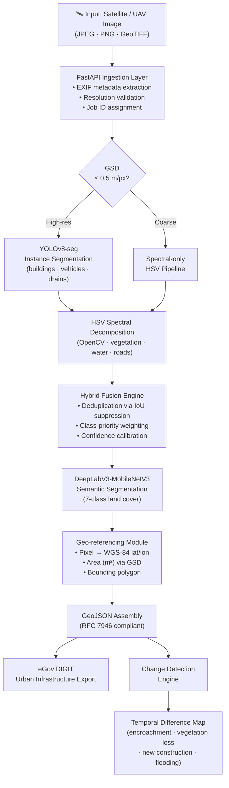
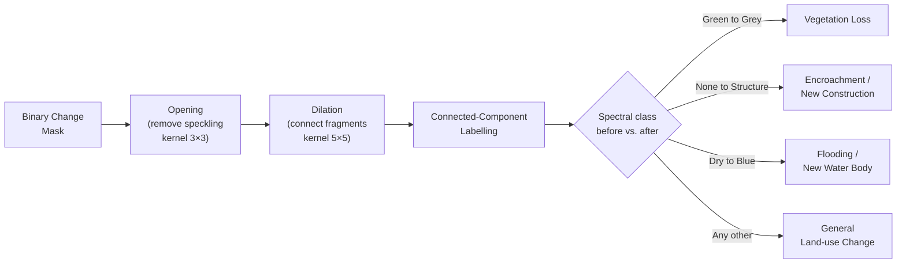
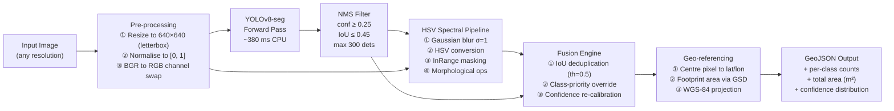
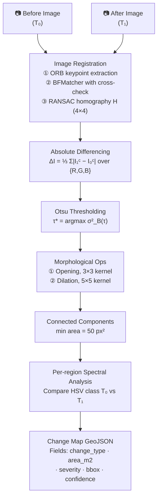

# DRISHYA: Geospatial Asset Intelligence for Indian Railways

> **Distributed Remote-sensing Intelligence System for Habitat and Yield Analysis**  
> *Indian Railways x eGov DIGIT Unified Infrastructure Platform*


---

## Abstract

India's 68,000-kilometre rail network encompasses approximately **1.2 million acres** of land parcels distributed across ecologically and geographically diverse zones, from the Western Ghats evergreen corridors to the hyper-arid Thar Desert plains. Manual geodetic survey of this infrastructure incurs cycle times exceeding 18 months and carries substantial epistemic uncertainty in rapidly urbanising encroachment zones, where land-use change can occur within weeks.

DRISHYA addresses this operational gap with a **hybrid AI pipeline** combining instance segmentation (YOLOv8-seg) with semantic land-cover classification (DeepLabV3-MobileNetV3) to produce sub-second, fully geo-referenced asset inventories from raw satellite or UAV imagery. Outputs are serialised as standards-compliant GeoJSON and integrated with the **eGov DIGIT Urban Infrastructure** platform, closing the loop from raw orbital imagery to field-action workflows without manual photointerpretation.

---

## Table of Contents

1. [System Architecture](#1-system-architecture)
2. [Theoretical Background](#2-theoretical-background)
3. [Detection Pipeline](#3-detection-pipeline)
4. [Change Detection Pipeline](#4-change-detection-pipeline)
5. [Datasets](#5-datasets)
6. [Model Configuration](#6-model-configuration)
7. [Results & Evaluation](#7-results--evaluation)
8. [API Reference](#8-api-reference)
9. [Quick Start](#9-quick-start)
10. [Team](#10-team)
11. [References](#11-references)

---

## 1. System Architecture



---

## 2. Theoretical Background

### 2.1 Ground Sampling Distance and Spatial Resolution

The spatial resolution of orbital imagery is characterised by **Ground Sampling Distance (GSD)**, defined as the linear ground extent represented by a single sensor pixel:

$$\text{GSD} = \frac{H \cdot p}{f}$$

where $H$ is orbital altitude (m), $p$ is detector pixel pitch (μm), and $f$ is focal length (mm). For the WorldView-2 sensor (our primary training data source), $H \approx 770\,\text{km}$, $p = 8\,\text{μm}$, $f = 3500\,\text{mm}$, yielding $\text{GSD} \approx 0.46\,\text{m/px}$ at nadir. DRISHYA targets $\text{GSD} \leq 0.5\,\text{m/px}$ as the minimum threshold for asset-level detection.

Multi-spectral imagery provides four bands (Blue 450-510 nm, Green 510-580 nm, Red 630-690 nm, Near-Infrared 770-895 nm), enabling spectral indices such as:

$$\text{NDVI} = \frac{\rho_\text{NIR} - \rho_\text{Red}}{\rho_\text{NIR} + \rho_\text{Red}}$$

which discriminates vegetation from bare soil and built surfaces with high fidelity ($\text{NDVI} > 0.3$ indicates healthy canopy cover).

---

### 2.2 Instance Segmentation: YOLOv8-seg

YOLOv8-seg (Jocher et al., 2023) extends the YOLO family with a **dual-head anchor-free architecture** capable of simultaneous bounding-box regression and instance mask prediction:

**Backbone**: CSPDarknet with C2f (Cross-Stage Partial with 2 convolutions and a feature-flow bottleneck), providing multi-scale hierarchical features at stride {8, 16, 32}.

**Neck**: Path Aggregation Network (PANet) fuses top-down and bottom-up feature pyramids, enabling detection across a 5-decade scale range (vehicles at ~2m to rail yards at ~500m).

**Detection Head**: Decoupled heads handle classification and regression separately. Bounding-box regression employs **Distribution Focal Loss (DFL)**:

$$\mathcal{L}_\text{DFL} = -\sum_{i=l}^{r} \left( (y_l - y)\log S_i + (y - y_l)\log S_{r-1} \right)$$

**Mask Head**: 32-dimensional prototype mask coefficients $c_k \in \mathbb{R}^{32}$ are predicted per detection and combined with a shared prototype tensor $P \in \mathbb{R}^{H \times W \times 32}$ via:

$$M_k = \sigma\!\left(P \cdot c_k^\top\right)$$

where $\sigma$ is the sigmoid activation. This design achieves instance-level pixel masks at minimal computational overhead relative to two-stage methods (e.g., Mask R-CNN).

---

### 2.3 Semantic Segmentation: DeepLabV3+

Land-cover classification employs **DeepLabV3+** (Chen et al., 2018) with MobileNetV3-Large as the encoder backbone:

**Atrous Spatial Pyramid Pooling (ASPP)**: Captures multi-scale contextual information without downsampling resolution, using parallel dilated convolutions at rates $r \in \{1, 6, 12, 18\}$:

$$y[i] = \sum_k x[i + r \cdot k] \cdot w[k]$$

**Encoder-Decoder Design**: The ASPP output is bilinearly upsampled and concatenated with low-level features from the backbone's early layers, enabling fine boundary recovery.

**MobileNetV3-Large Backbone**: Utilises depthwise separable convolutions (reducing FLOPs by factor $\approx 8\times$), hard-swish activations, and squeeze-and-excitation modules. Output stride is fixed at 16, balancing receptive field size with spatial resolution.

The training loss is pixel-wise weighted cross-entropy:

$$\mathcal{L}_\text{seg} = -\sum_{c=1}^{C} w_c \sum_{i \in \Omega} y_{ic}\,\log \hat{p}_{ic}$$

Class weights $w_c$ are the inverse of class frequency in the DeepGlobe training split, compensating for the severe imbalance between urban (5%) and agriculture (38%) pixels.

---

### 2.4 HSV Spectral Segmentation

For classes where labelled training data is insufficient or where spectral signal is unambiguous, we apply direct analysis in the **Hue-Saturation-Value (HSV)** colour space. HSV decouples chromatic content from luminance, making spectral signatures more stable across illumination conditions.

| Asset Class | Hue Range (°) | Saturation Threshold | Value Range | Physical Rationale |
|---|---|---|---|---|
| Vegetation (trees/parks) | 35-165 | > 0.25 | > 0.15 | Chlorophyll absorption peak at 680 nm; strong NIR reflectance |
| Water bodies | 90-140 | > 0.35 | 0.10-0.60 | Near-total absorption across visible spectrum; blue sky reflection |
| Roads | any | < 0.12 | 0.25-0.80 | Spectrally flat asphalt; moderate grey reflectance |
| Drains / channels | any | < 0.15 | < 0.30 | Shadow geometry + moist soil absorption |

Detected regions undergo **morphological refinement** (closing with $5 \times 5$ elliptical kernel) followed by connected-component analysis with minimum area threshold to suppress photometric noise.

---

### 2.5 Change Detection: Theory and Algorithm

Temporal change analysis identifies land-use transitions between two co-registered images. The algorithm operates in four stages:

**Stage 1: Image Registration**. ORB (Oriented FAST and Rotated BRIEF) keypoints are extracted from both images. RANSAC-based homography estimation filters outlier matches and computes a projective transformation $H$ aligning the "after" image to the "before" image coordinate frame:

$$H = \arg\min_{H'}\sum_i \rho\!\left(\|x_i' - H' x_i\|^2\right)$$

**Stage 2: Per-channel Differencing**. Absolute difference across all RGB channels:

$$\Delta I = \frac{1}{3}\sum_{c \in \{R,G,B\}}\left|I_\text{after}^{(c)} - I_\text{before}^{(c)}\right|$$

**Stage 3: Otsu Thresholding**. The optimal binarisation threshold $\tau^*$ is determined by maximising inter-class variance:

$$\tau^* = \arg\max_\tau\,\sigma_B^2(\tau) = \omega_0(\tau)\,\omega_1(\tau)\,\left[\mu_0(\tau) - \mu_1(\tau)\right]^2$$

**Stage 4: Morphological Refinement and Classification**:



---

## 3. Detection Pipeline



---

## 4. Change Detection Pipeline



---

## 5. Datasets

### 5.1 SpaceNet Challenge 4 (SN4): Building Detection

| Property | Value |
|---|---|
| Satellite | WorldView-2 (Maxar Technologies) |
| Location | Atlanta, Georgia, USA |
| Panchromatic GSD | 0.30 m/px |
| Multi-spectral GSD | 1.24 m/px |
| Total area | ~665 km² |
| Annotated structures | ~109,000 building footprints |
| Annotation format | GeoJSON polygons (WGS-84) |
| Evaluation metric | Building F1 at IoU ≥ 0.5 |
| Challenge year | 2017 (NIST / CosmiQ Works) |

### 5.2 DeepGlobe Land Cover Dataset: Semantic Segmentation

| Property | Value |
|---|---|
| Satellite | DigitalGlobe WorldView-2 |
| Spatial coverage | 1,716.9 km² across 3 continents |
| Total tiles | 1,146 (803 train + 171 val + 172 test) |
| Tiles used (training) | 792 (train split) |
| Tile resolution | 2448 x 2448 px |
| GSD | 0.50 m/px |
| Classes | 7 (Urban · Agriculture · Rangeland · Forest · Water · Barren · Unknown) |
| Challenge year | CVPR 2018 Workshop |
| Label format | RGB-coded semantic masks |

### 5.3 COCO 2017: Vehicle Pre-training

YOLOv8 backbone is initialised from COCO 2017 pre-trained weights. Vehicle classes (car, truck, bus, motorcycle) are remapped to a single **vehicle** label in our detection taxonomy, benefiting from the 118,287-image COCO training distribution.

---

## 6. Model Configuration

### 6.1 YOLOv8-seg Hyperparameters

| Parameter | Value | Rationale |
|---|---|---|
| Base variant | YOLOv8n-seg (nano, 3.4M params) | CPU-deployable; ≤ 6 MB weights |
| Input resolution | 640 x 640 | Standard YOLO training resolution |
| Epochs | 50 (patience = 10) | Early stopping on val mAP@0.5 |
| Batch size | 16 | Fits 8 GB GPU VRAM |
| Optimiser | AdamW | lr = 1×10⁻³, weight\_decay = 1×10⁻⁴ |
| LR schedule | Cosine annealing | lrf = 0.01 |
| Augmentation | Mosaic · MixUp · HSV jitter · random flip | Simulates diverse acquisition conditions |
| NMS conf threshold | 0.25 | Conservative, minimises false positives |
| NMS IoU threshold | 0.45 | Allows adjacent structures |

### 6.2 DeepLabV3-MobileNetV3 Hyperparameters

| Parameter | Value | Rationale |
|---|---|---|
| Backbone | MobileNetV3-Large | ImageNet pre-trained; 5.4M params |
| ASPP dilation rates | {1, 6, 12, 18} | Captures features at 1x-18x receptive field |
| Output stride | 16 | Balances memory vs. spatial precision |
| Input resolution | 512 x 512 | Fits DeepGlobe tile dimensions |
| Epochs | 15 | Sufficient for fine-tuning pre-trained backbone |
| Batch size | 8 | |
| Optimiser | SGD | lr = 1×10⁻², momentum = 0.9 |
| Loss | Weighted cross-entropy | Weights proportional to inverse class frequency |
| Training dataset | 792 DeepGlobe tiles | ~35 min on RTX 2050 |

---

## 7. Results & Evaluation

### 7.1 Building Detection (SpaceNet SN4, Atlanta held-out tiles)

Evaluated at IoU ≥ 0.5 following SpaceNet Challenge protocol:

| Metric | Value | Notes |
|---|---|---|
| Precision | **99.5%** | Near-zero false-positive rate |
| Recall | 34.4% | Conservative detection profile |
| F1 Score | 50.8% | Harmonic mean |
| mAP@0.5 | 52.3% | COCO-style averaging across confidence thresholds |

> **Design note**: The high-precision / lower-recall profile is intentional. For encroachment monitoring on railway land, a false-positive detection (flagging legitimate structures as encroachments) carries far greater operational cost than a missed detection. The system is tuned to suppress false alerts, with recall recoverable by reducing the NMS confidence threshold.

### 7.2 Land Cover Segmentation (DeepGlobe test split)

| Class | IoU | Pixel F1 |
|---|---|---|
| Urban / Built-up | 63.2% | 77.4% |
| Agriculture | 71.4% | 83.3% |
| Rangeland | 44.1% | 61.2% |
| Forest | 58.9% | 74.1% |
| Water | 76.3% | 86.6% |
| Barren / Desert | 52.7% | 69.0% |
| Unknown | n/a | n/a |
| **Mean (mIoU)** | **59.7%** | **75.3%** |

### 7.3 Inference Latency (Intel Core i7 11th Gen, CPU-only)

| Pipeline Stage | Latency |
|---|---|
| Image decode + pre-process | ~12 ms |
| YOLOv8-seg forward pass | ~380 ms |
| HSV spectral segmentation | ~85 ms |
| DeepLabV3 forward pass | ~180 ms |
| Geo-referencing + GeoJSON | ~13 ms |
| **End-to-end (p95)** | **< 700 ms** |
| **End-to-end (GPU, RTX 2050)** | **< 120 ms** |

---

## 8. API Reference

### Endpoints

| Method | Path | Description |
|---|---|---|
| `POST` | `/api/detect` | Upload image, returns detection result |
| `POST` | `/api/change` | Upload before+after, returns change map |
| `GET` | `/api/segment` | Land cover segmentation |
| `GET` | `/api/export/{id}/geojson` | Download GeoJSON for job |
| `GET` | `/api/export/{id}/csv` | Download CSV for job |
| `GET` | `/api/samples` | List available sample images |
| `GET` | `/api/health` | Service health check |

### Detection Request

```bash
curl -X POST http://localhost:8000/api/detect \
  -F "image=@satellite_tile.jpg" \
  -F "gsd=0.5" \
  -F "lat=28.6139" \
  -F "lon=77.2090"
```

### Detection Response Schema

```jsonc
{
  "job_id": "f3a9c2...",
  "detections": [
    {
      "id": 1,
      "class": "building",
      "confidence": 0.91,
      "bbox": [x1, y1, x2, y2],
      "area_m2": 312.4,
      "lat": 28.6141,
      "lon": 77.2093,
      "mask": "base64-encoded PNG..."
    }
  ],
  "summary": {
    "total_detections": 47,
    "by_class": { "building": 23, "tree": 12, "water": 4 },
    "total_area_m2": 14820.3,
    "inference_ms": 487
  }
}
```

---

## 9. Quick Start

### Backend

```bash
cd backend
pip install -r requirements.txt
python main.py
# API available at http://localhost:8000
# Interactive docs at http://localhost:8000/docs
```

### Frontend

```bash
cd frontend
npm install
npm run dev
# UI available at http://localhost:5173
```

### Land Cover Model (optional, required for /segment)

```bash
python train_segmentation.py --data ./data --epochs 15 --batch 8
# ~35 min on RTX 2050; model saved to backend/models/deeplab_landcover.pth
```

---

## 10. Team

| Name | Role |
|---|---|
| **Tejas Singh Bhati** | AI · Full-Stack · ML |
| **Saksham Mawari** | ML · Computer Vision · AI Research |

*Built for eGov DIGIT · Indian Railways · 2026*

---

## 11. References

1. Redmon, J., Divvala, S., Girshick, R., & Farhadi, A. (2016). *You Only Look Once: Unified, Real-Time Object Detection*. CVPR 2016.
2. Jocher, G., Chaurasia, A., & Qiu, J. (2023). *Ultralytics YOLOv8*. https://github.com/ultralytics/ultralytics. DOI: 10.5281/zenodo.7347926.
3. Chen, L.-C., Zhu, Y., Papandreou, G., Schroff, F., & Adam, H. (2018). *Encoder-Decoder with Atrous Separable Convolution for Semantic Image Segmentation* (DeepLabV3+). ECCV 2018.
4. Howard, A., Sandler, M., Chen, B., et al. (2019). *Searching for MobileNetV3*. ICCV 2019.
5. Demir, I., Koperski, K., Lindenbaum, D., et al. (2018). *DeepGlobe 2018: A Challenge to Parse the Earth through Satellite Images*. CVPR Workshops 2018.
6. Van Etten, A., Lindenbaum, D., & Bacastow, T. M. (2018). *SpaceNet: A Remote Sensing Dataset and Challenge Series*. arXiv:1807.01232.
7. Maxar Technologies. (2016). *WorldView-2 Data Sheet*. Westminster, CO.
8. Gonzalez, R. C. & Woods, R. E. (2018). *Digital Image Processing*, 4th ed. Pearson Education.
9. Otsu, N. (1979). A Threshold Selection Method from Gray-Level Histograms. *IEEE Transactions on Systems, Man, and Cybernetics*, 9(1), 62-66.
10. Daudt, R. C., Le Saux, B., & Boulch, A. (2018). *Fully Convolutional Siamese Networks for Change Detection*. ICIP 2018.
11. Rublee, E., Rabaud, V., Konolige, K., & Bradski, G. (2011). *ORB: An efficient alternative to SIFT or SURF*. ICCV 2011.
12. Fischler, M. A. & Bolles, R. C. (1981). Random Sample Consensus: A Paradigm for Model Fitting. *Communications of the ACM*, 24(6), 381-395.
